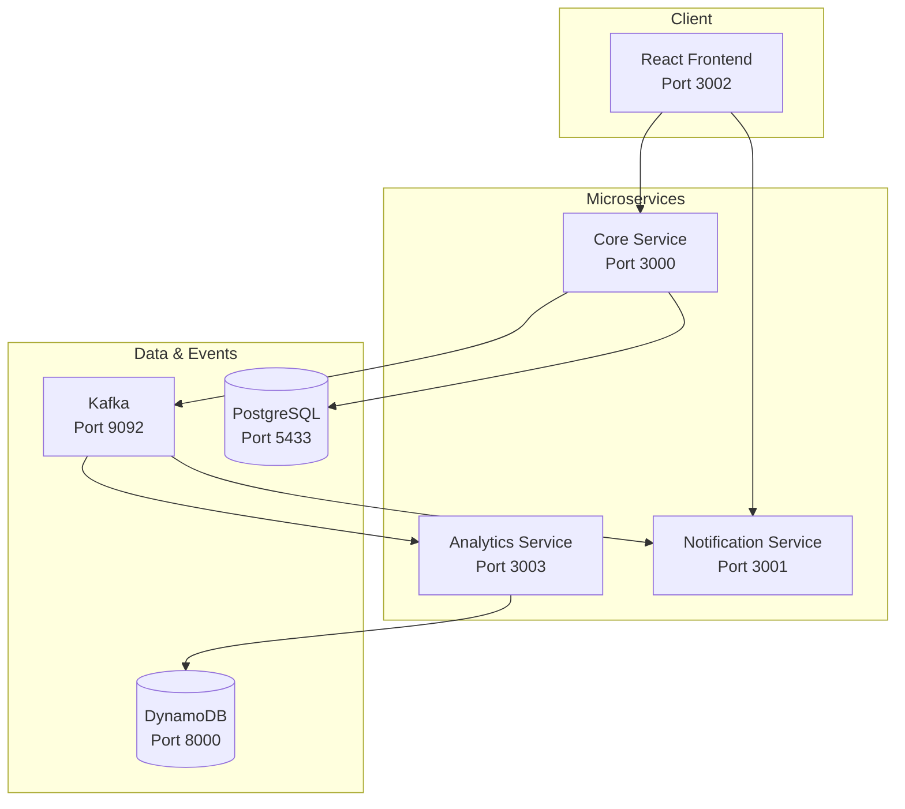
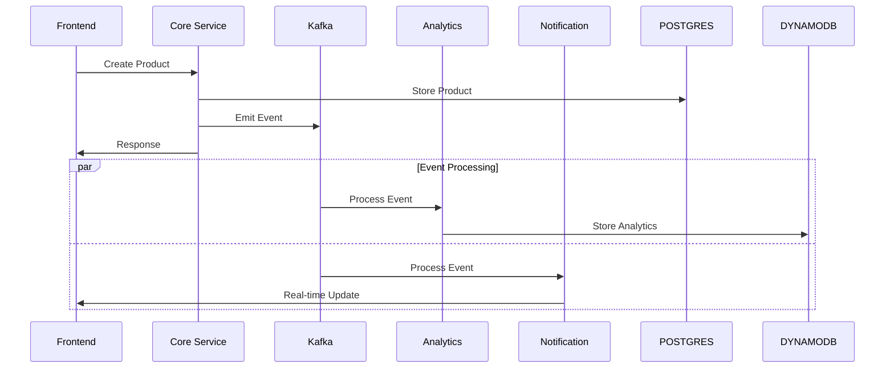

# Architecture Diagram

## System Overview

```mermaid
graph TB
    subgraph "Client"
        UI[React Frontend<br/>Port 3002]
    end
    
    subgraph "Microservices"
        CORE[Core Service<br/>Port 3000]
        ANALYTICS[Analytics Service<br/>Port 3003]
        NOTIFICATION[Notification Service<br/>Port 3001]
    end
    
    subgraph "Data & Events"
        KAFKA[Kafka<br/>Port 9092]
        POSTGRES[(PostgreSQL<br/>Port 5433)]
        DYNAMODB[(DynamoDB<br/>Port 8000)]
    end
    
    UI --> CORE
    UI --> NOTIFICATION
    CORE --> KAFKA
    CORE --> POSTGRES
    KAFKA --> ANALYTICS
    KAFKA --> NOTIFICATION
    ANALYTICS --> DYNAMODB
```

## Event Flow

```mermaid
sequenceDiagram
    participant UI as Frontend
    participant CORE as Core Service
    participant KAFKA as Kafka
    participant ANALYTICS as Analytics
    participant NOTIFICATION as Notification
    
    UI->>CORE: Create Product
    CORE->>POSTGRES: Store Product
    CORE->>KAFKA: Emit Event
    CORE->>UI: Response
    
    par Event Processing
        KAFKA->>ANALYTICS: Process Event
        ANALYTICS->>DYNAMODB: Store Analytics
    and
        KAFKA->>NOTIFICATION: Process Event
        NOTIFICATION->>UI: Real-time Update
    end
```